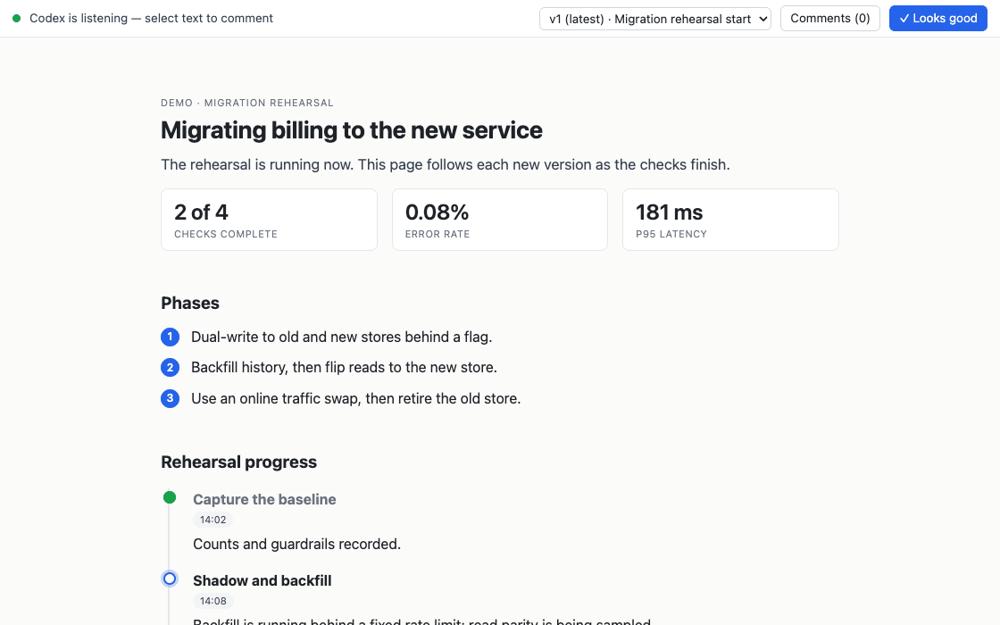

# colloquy

A Claude Code plugin: Claude presents plans and write-ups as a web page instead of a
wall of terminal text. Select any line to comment on it like a shared doc; your comment
wakes the session, and Claude ships a revised version.



[`docs/index.html`](docs/index.html) is the tour: what it does and a review end to end.
[`docs/how-it-works.html`](docs/how-it-works.html) covers the mechanism. Both are set in
colloquy's own theme, so they double as specimens. Open them in a browser from a
checkout.

## Install

```
/plugin marketplace add max-sixty/colloquy
/plugin install colloquy@colloquy
```

That's it. No config, no accounts. It needs [`uv`](https://docs.astral.sh/uv/) on your
PATH (`interact.py` is a `uv` script, its dependencies declared in a PEP 723 header) and
a browser on the same machine as the session.

Then ask Claude for a page, or run `/colloquy [topic]`, which with no argument presents
whatever the session is currently about.

## Experimental: plan-mode integration

`/colloquy-plans on` redirects Claude's plan mode into a colloquy page: instead of
approving a plan in the terminal, you review it in the browser. It's off by default and
global. This one is a prototype (it auto-approves the plan-mode exit so the page can be
built), so try it deliberately. `/colloquy-plans off` restores normal plan mode.

## Examples

[`examples/`](examples/) holds a complete page for each kind of write-up, plus
`gallery.html`, which puts them on one page as tabs (generated by `scripts/gallery.py`;
edit the examples, not it). Serve one against the shipped layer to try it:

```
uv run skills/colloquy/scripts/interact.py init /tmp/demo
cp examples/triage-board.html /tmp/demo/versions/v001.html
uv run skills/colloquy/scripts/interact.py note /tmp/demo --version 1 --text "demo"
uv run skills/colloquy/scripts/interact.py serve /tmp/demo
```

## Developing

The suite is integration tests over the real thing. `test_interact.py` exercises the
lint, vendoring, publishing, catalog, export, and reply validation. `test_render.py`
loads the shipped examples in a real browser (both color schemes) and asserts what a
static lint can't reach: every widget upgrades into a box with usable size, the document
and the comment panel scroll in separate regions, and the comment box grows without any
script sizing it. One journey test drives the whole review loop through the real UI
(select a passage, comment, drag a card, follow the next version, find the comment still
anchored) and pins the event log it leaves. `test_product_page.py` holds the pages under
`docs/` to the shipped theme and widget registry. Playwright attaches to the Chrome
already installed (`channel="chrome"`), so there is no browser download and still no
build step. Driving a page by hand to check a change works the same way: `init` the
directory, then serve it from `interact.Handler` in-process as the fixtures do. `serve`
instead puts a live review behind the session, and the review-loop hooks then hold it to
watching that page.

```
uv run --with pytest --with click --with jsonschema --with playwright python -m pytest tests
```

## Recording the demo

`scripts/record-demo.sh` prints a shot list and the setup for capturing the README GIF
against a real colloquy page. Drop the result at `docs/demo.gif`.

## Related

[Workbench](https://workbench.md/) meets the same moment (reviewing an agent's work in a
browser) from the opposite direction: a hosted, multiplayer markdown workspace where
teams of agents and humans coordinate through one shared doc, with anchored comments,
suggestion mode, task claiming, and an event feed. Colloquy is the inverse on each axis:
local files and a loopback port instead of a hosted service; one session presenting to
one reviewer instead of a fleet co-editing; an authored HTML page with diagrams instead
of a markdown doc. The trade shows up in the plumbing: a hosted doc cannot invoke your
agent, so Workbench ships a daemon layer (watchers, heartbeats, supervisors) to keep
agents responsive, while colloquy runs inside Claude Code, where the harness re-invokes
the session the moment a comment lands.

[html-effectiveness](https://github.com/anthropics/html-effectiveness) is a gallery of
standalone HTML examples (code review, status reports, diagrams, small editing UIs)
demonstrating HTML as a flexible, dependency-free output format, the same idea behind
colloquy's handover page.

## License

MIT. See [LICENSE](LICENSE).
